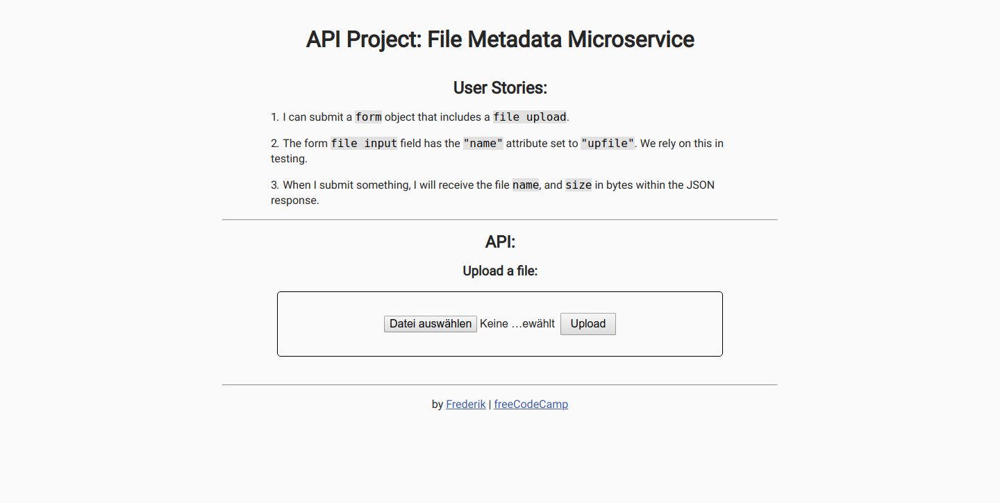

# File Metadata

## Introduction
This form returns the file name and file size as JSON for any kind of submitted file.

This project is part of freeCodeCamps API And Microservices certificate.

***

## Project Requirements
* It is possible to submit a form that includes a file upload.
* The form file input field has the "name" attribute set to "upfile". We rely on this in testing.
* Submitting a file will return the file name and size in bytes within the JSON response.

***

## Project Data
Multer  
https://www.npmjs.com/package/multer

***

## Final Project
https://fcc-api-file-metadata-fred.glitch.me

***

## Behind the scenes
### Backend:
* Node
* Express
* Multer

### Hosting:
* Glitch

***

## Preview Images
### Main Screen:

